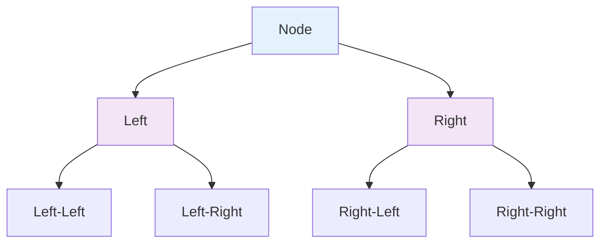

Recursion is one of those concepts that either clicks immediately or remains stubbornly opaque. The difference often comes down to mental models. Trees—both the data structure and the visual metaphor—are perhaps the most powerful lens for understanding recursive processes.

## The Recursive Insight

Every recursive function has two essential parts:

1. **Base case** — The simplest possible input where the answer is known immediately
2. **Recursive case** — Breaking the problem into smaller instances of itself

This mirrors exactly how a tree works: a tree is either a leaf (base case) or a node with subtrees (recursive case).

```python
def tree_size(node):
    if node is None:          # Base case: empty tree
        return 0
    return 1 + tree_size(node.left) + tree_size(node.right)  # Recursive case
```

## Visualizing the Call Stack

When you trace `tree_size(root)`, you're essentially walking the tree. Each function call corresponds to visiting a node. The call stack depth equals the tree height.

```
tree_size(root)
├── tree_size(left_child)
│   ├── tree_size(left_grandchild) → 1
│   └── tree_size(right_grandchild) → 1
│   → returns 3
└── tree_size(right_child)
    ├── tree_size(left_grandchild) → 1
    └── tree_size(None) → 0
    → returns 2
→ returns 6
```

## Tree Traversals as Recursive Patterns

The three classic traversals are just different orderings of the same recursive template:



**Pre-order**: Process node, then left, then right — useful for copying trees  
**In-order**: Left, node, right — gives sorted order for BSTs  
**Post-order**: Left, right, node — useful for deleting trees  

## Tail Recursion and Iteration

Some recursive algorithms can be transformed into iterative ones using explicit stacks. This is essentially what the call stack does automatically.

```python
def tree_size_iterative(root):
    if not root:
        return 0
    stack, count = [root], 0
    while stack:
        node = stack.pop()
        count += 1
        if node.right:
            stack.append(node.right)
        if node.left:
            stack.append(node.left)
    return count
```

The recursive version is often clearer; the iterative version avoids stack overflow on deep trees.

## When Recursion Shines

Recursion excels when:
- The problem structure is naturally recursive (trees, graphs, divide-and-conquer)
- The recursive solution is significantly more readable
- The recursion depth is bounded (balanced trees, logarithmic algorithms)

It struggles when:
- Deep recursion risks stack overflow (unbalanced trees, naive Fibonacci)
- Overlapping subproblems exist (dynamic programming is better)
- Performance is critical and function call overhead matters

## The Deeper Pattern

Recursion isn't just a programming technique—it's a way of seeing self-similarity in problems. Once you recognize the fractal nature of a problem (the whole has the same structure as its parts), the recursive solution often writes itself.

Trees make this visible. Every subtree is a tree. Every recursive call solves a smaller version of the same problem. The base case is just the smallest possible tree: a single node, or nothing at all.

---

*Next time you're stuck on a recursive problem, draw the tree. The answer is usually in the branches.*