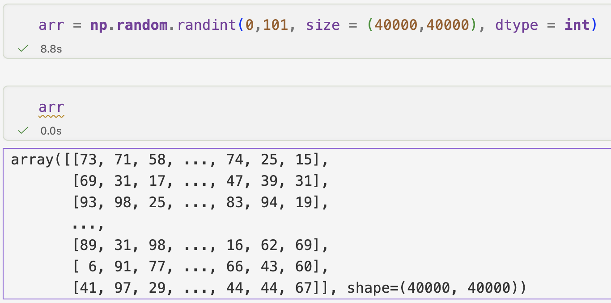
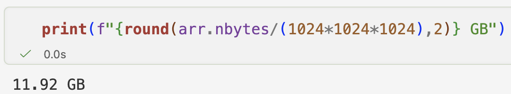
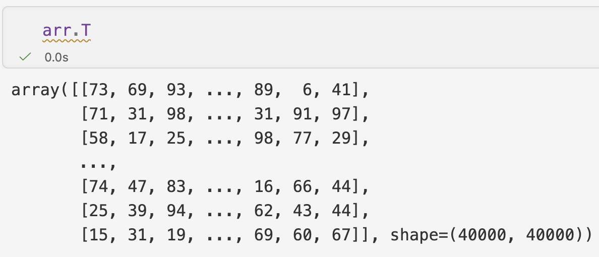
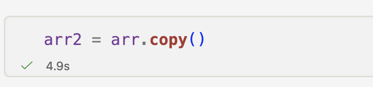

Most operations on large NumPy arrays are computationally expensive, so I naturally assumed that transposing one would involve rearranging huge chunks of data in memory. But when I tried it and saw it happen almost instantly, I was surprised.

How could a large transformation of this kind happen without any noticeable delay?

Imagine we have a matrix,

```python
import numpy as np
arr = np.array([
    [1,2,3],
    [4,5,6]
])

arr
## returns below output ##
array([[1, 2, 3],
       [4, 5, 6]])
```

After applying transpose, we get

```python
arr.T
## returns below output ##
array([[1, 4],
       [2, 5],
       [3, 6]])
```

At first, this operation felt expensive. I thought NumPy moves around elements in the memory to create this. Surprisingly, it usually doesn’t. Even for massive arrays, the transpose itself is usually an O(1) operation. If rows become columns, how can data remain untouched? Where does this new arrangement come from?

It turns out that NumPy transpose usually doesn’t move around the data, it only changes the way it interprets it and that leads us to one of the coolest concepts in NumPy - ***STRIDES***

To understand what is happening, we need to first look at how arrays are stored in memory. Although, we think of a matrix as rows and columns, the underlying memory is just a continuous block of bytes. So our earlier example of array,

```python
array([[1, 2, 3],
       [4, 5, 6]])
```

is stored as a continuous block

`[1,2,3,4,5,6]`

NumPy simply knows the shape of the array, datatype and more importantly for our discussion here, how to traverse through elements in the memory to access it correctly. This is where strides comes in.

Lets see what NumPy gives us for the same array, *arr*

```python
arr.strides
## returns below output ##
(24, 8)
```

While, this might look a bit cryptic, but it is what helps with transpose. These tell the NumPy how many bytes it needs to jump in memory to move along each axis (rows, columns).

For the array, *arr,*

Moving down **one row** requires **jumping 24 bytes** (3 columns x 8 bytes [per integer]) .

Moving across **one column** requires **jumping 8 bytes.**

Now, here is the interesting part, when an array is transposed, **the strides are simply reversed**. That’s it!

All transpose did was reverse the strides NumPy uses to access rows and columns. And guess what the strides of the transposed array are?

```python
arr.T.strides
## returns below output ##
(8, 24)
```

We can actually verify that no new underlying data buffer was created

```python
np.shares_memory(arr, arr.T)
## returns below output ##
True
```

Confirms that the original array and its transpose point to the same underlying data. In my opinion, this distinction between copying data and simply changing how it is viewed turns out to be one of NumPy's biggest strengths.

The performance difference becomes much more obvious with large arrays





Transposing it takes less than a second.



A deep copy took almost 5 seconds as `.copy()` creates it as a new block of data



One interesting caveat is that while transpose is cheap, operations on transposed arrays can sometimes become slower afterward, but that’s for another time!

What this made me appreciate is that the real power of libraries like NumPy, isn’t just numerical computation, a huge part of it comes from how intelligently they interpret memory.

*What was the first NumPy concept that changed how you thought about computation?*
